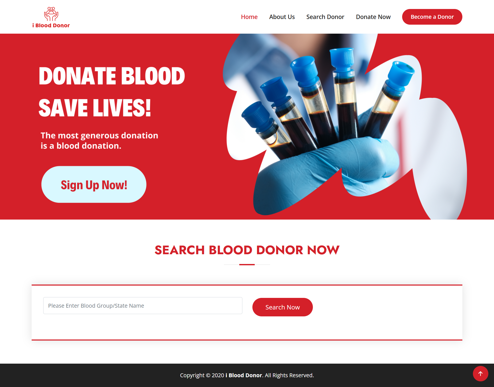
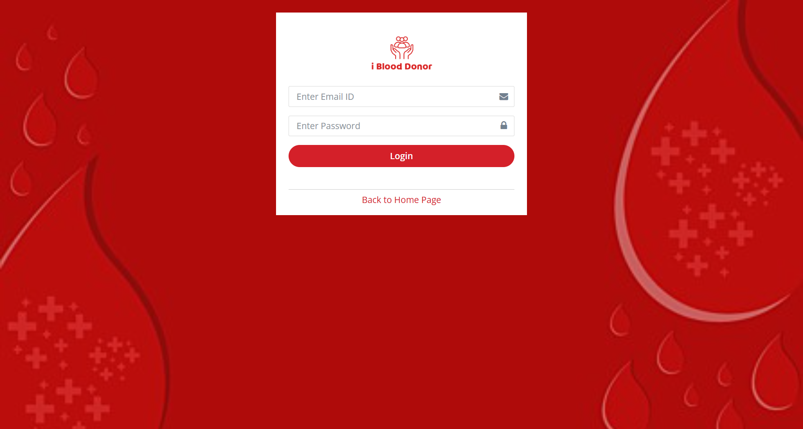
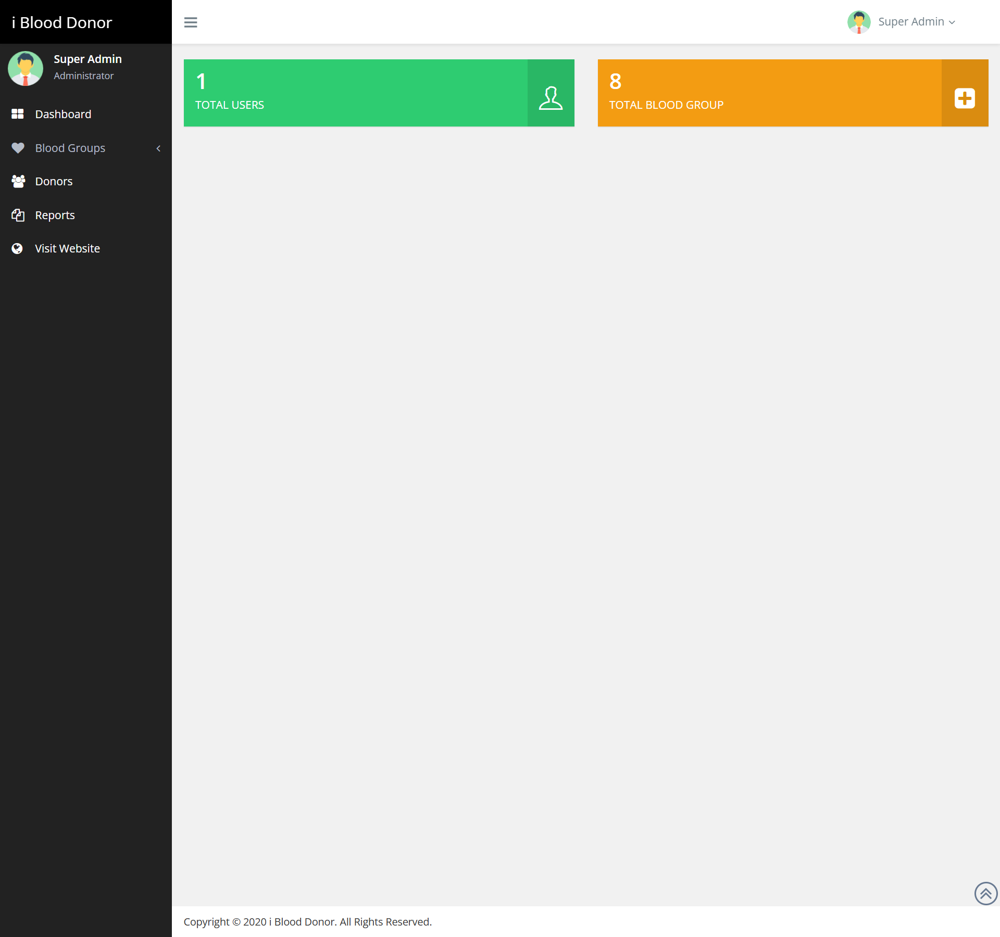
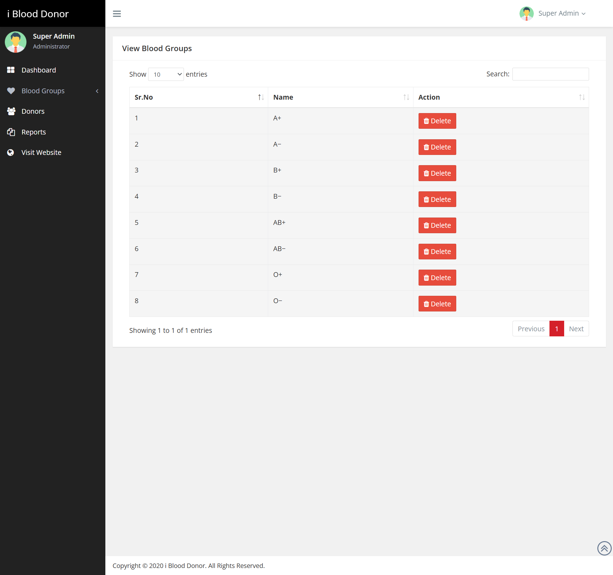
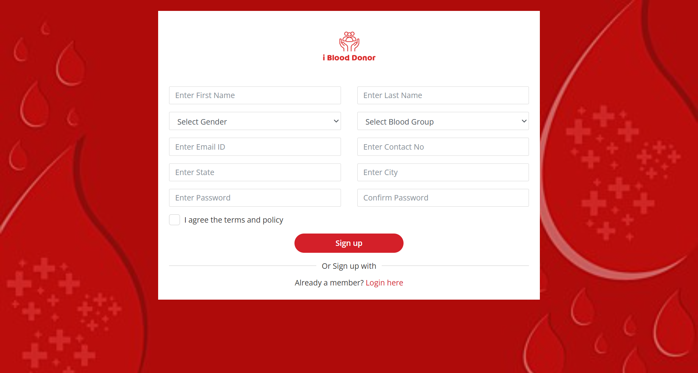
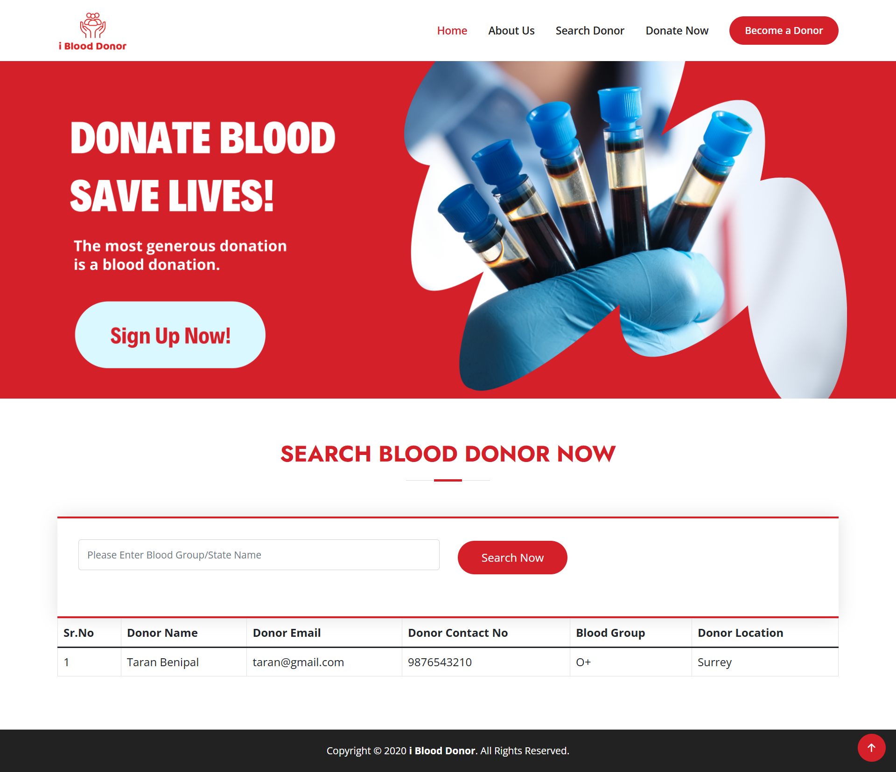

# 🩸 CodeIgniter-Blood-Donation-App (i Blood Donor)

The **CodeIgniter-Blood-Donation-App (i Blood Donor)** is a web-based application designed to streamline and manage blood donor data efficiently. Developed using the **CodeIgniter PHP framework** and **MySQL database**, this application allows users to find blood donors based on blood group and location, and provides an intuitive dashboard for administrators to manage records.

---

## 🚀 Project Overview

**i Blood Donor** helps connect people in need of blood with eligible donors. The system supports three types of users: Admin, Donor, and Guest User. It provides secure access, profile management, and a search interface to find donors by blood group and state.

---

## 🛠️ Technologies Used

| Component            | Technology                            |
|----------------------|----------------------------------------|
| **Backend**          | PHP 5.6 / PHP 7.x                      |
| **Framework**        | [CodeIgniter](https://codeigniter.com/) |
| **Database**         | MySQL 5.x                              |
| **Frontend**         | HTML, CSS, JavaScript, jQuery, AJAX   |
| **Web Server**       | XAMPP / WAMP / MAMP / LAMP             |
| **Supported Browsers** | Chrome, Firefox, Opera, IE8+        |

---

## 📁 Project Modules

### 🔐 Admin Module
- **Dashboard**: Overview of blood groups and registered donors.
- **Blood Groups**: Add or delete blood group types.
- **User Details**: View or delete donor registrations.
- **Profile**: Edit admin profile details.
- **Change Password**: Update the admin password.
- **Logout**: End admin session securely.

### 👤 Donor Module
- **Signup**: Register as a blood donor.
- **Signin**: Login with email and password.
- **User Profile**: Update personal and donation details.
- **Change Password**: Update donor account password.
- **Logout**: Securely log out of the session.

### 🔎 Public User Module
- **Search Donors**: Search for donors by blood group and state.
- **Read-only Access**: No login required.

---

## 📸 Screenshots

### 🏠 Home Page  


### 🔐 Admin Login Page  


### 📊 Admin Dashboard  


### ➕ View Blood Group  


### 👤 Donor Registration Page  


### 🔎 Search Donor Page  


---

## 📦 Installation Instructions

1. **Clone the repository**
   ```bash
   git clone https://github.com/yourusername/CodeIgniter-Blood-Donation-App.git
   ```
2. Move project to your local server root

    For XAMPP: htdocs/
   
    For WAMP: www/

3. Create a MySQL database

    Import the SQL file from the /database folder into your phpMyAdmin.

4. Configure the application

    Update database credentials in application/config/database.php

    Update base URL in application/config/config.php
5. Run the app

    Open your browser and navigate to:

    ```
    http://localhost/CodeIgniter-Blood-Donation-App
    ```
---

### 🔐 Default Login Credentials   

   ## 👨‍💼 Admin Login
   
   Email: admin@gmail.com
   
   Password: 123456
   
   ## 👨‍💼 Donor Login
   
   Email: donor@gmail.com
   
   Password: 123456

## 🙌 Contributing

Feel free to fork this repository and submit pull requests. For major changes, please open an issue first to discuss what you'd like to change.  
